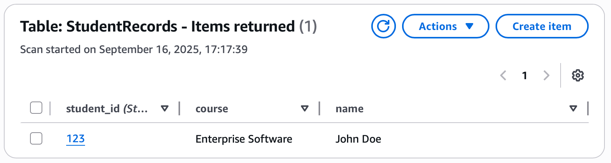
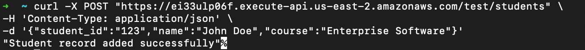
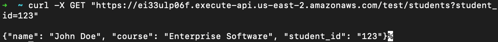

# Building a Serverless Web Application with AWS Lambda and DynamoDB

## Objective
In this assignment, a simple serverless web application using AWS Lambda and Amazon DynamoDB as the database service was created. The goal is to understand how to:
1. Trigger a Lambda function using an API Gateway.
2. Interact with DynamoDB to perform basic operations (Create, Read).
3. Deploy and test the application in the AWS environment.

## Screenshots
Screenshots of the DynamoDB table with sample record and successful API requests

### DynamoDB Table


### Create
```bash
curl -X POST "https://ei33ulp06f.execute-api.us-east-2.amazonaws.com/test/students" \
  -H 'Content-Type: application/json' \
  -d '{"student_id":"123","name":"John Doe","course":"Enterprise Software"}'
```


### Read
```bash
[# Terminal 2
curl -X GET "https://ei33ulp06f.execute-api.us-east-2.amazonaws.com/test/students?student_id=123"
```


## Reflection
Write a brief reflection on the challenges you faced and what you learned from using AWS Lambda and DynamoDB.

While creating this serverless CRUD API with AWS Lambda and DynamoDB, the main challenges were permissions. I encountered HTTP 502 errors so I looked at the CloudWatch logs and saw that it had an ERROR AccessDeniedException, meaning my Lambda role did not have permission to write to DynamoDB. To resolve this I had to attach the AmazonDynamoDBFullAccess policy. Another small issue I had was realizing that quoting the URL matters when testing with zsh. The last issue was something that I noticed but did not impact me, as I was working and switched from DynamoDB to AWS Lambda, it switched me from us-east-2 to us-east-1 automatically. Luckily I caught it and just manually switched back otherwise it would have led to issues.
